# ELSv2

[TOC]

## Demos

Some short demos available on YouTube

https://www.youtube.com/channel/UCVE05OvPm0yVd1yQSVZ0YSA/videos

## Hardware

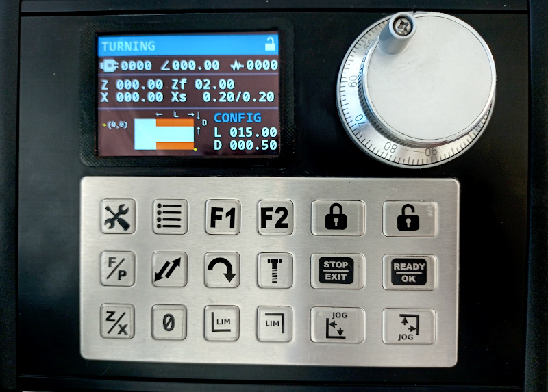

**IMPORTANT NOTE**

1. Ensure all signal cables are shielded.
2. Ensure the shielding is connected to ground at one end, close to the enclosure.
3. Ensure the enclosure is connected to power ground.
4. Always jog both axes to origin position (0, 0) before starting turning operations
    - This ensures any leadscrew backlash is taken care of in the lathe.
    - Allows the backlash compensation to kick in, ready for the turning steps.

### Kicad assets

All hw designs are done in Kicad 6.0.

- hw/els: The main board.
- hw/lcd: The LCD adapter for ILI9481 module

Optional extras:

- hw/buffer: Buffer and pulse shaper, helps keep the PUL signals going to the stepper drivers clean.
- hw/demo-driver: A standalone demo board with drv8825 for testing
- hw/power-clamp: Voltage clamp / suppression board.

### Main Board

Kicad files in hw/els

#### Active components

* Nucleo-F446RE https://www.st.com/en/evaluation-tools/nucleo-f446re.html
* GL850G USB HUB Controller
* CH340C USB UART
* FT24C64A EEPROM

The Nucleo 64 is connected to the main board USB hub with a small cable. Nucleo 446RE will need a fair few
jumper changes and soldering to permit the firmware to use the required GPIO pins.

Refer to the GPIO pins listed below, the solder bridges for these pins should be setup correctly. See Nucleo 446RE
documentation UM1724, Section 6.9 on Solder Bridges.

#### Using main board without USB hub & USB UART

The main board is primarily a breakout board for the Nucleo F446RE with a USB hub, USB USART controller
and additional terminal connectors. You can skip these (GL850G, CH340C and associated passives) and directly
wire PA9 and PA10 to the CN3 connectors marked RX and TX respectively. This will allow you to read the serial
comms via the onboard stlink CDC device.

The default UART baud rate in firmware is 921600, with 8 bits, no partity & 1 stop bit.

#### External Oscillator (HSE) on Nucleo 64

By default the firmware configures the clock to use the HSE. Nucleo 64 boards do not come with the crystal and passives
populated. Refer to UM1724 Section 6.7.1 for instructions on using HSE.

The following configuration is needed:
  - SB54 and SB55 OFF
  - R35 and R37 soldered
  - C33 and C34 soldered with 20 pF capacitors
  - SB16 and SB50 OFF

It's recommended to use an external crystal for better timing accuracy, but this is optional. If you want to use the
internal oscillator, set the `ELS_USE_HSE` directive to 0 in src/clock.c

#### EEPROM

This is again optional but without an external FT24C64A EEPROM, you will not be able to save the settings and the
defaults from constants.h will be used.

### ILI9481 Breakout

Kicad files in hw/lcd

This primarily a carrier / breakout board with an IDC ribbon cable connector to main board.

* ILI9481 TFT LCD, https://www.aliexpress.com/item/1005001288341298.html
* The main board is connected to the LCD module using an adapter board that breaks out the pins to a 16 pin IDC socket.

### Output buffer / pulse shaper

Kicad files in hw/buffer

Optional add-on for cleaning up the high frequency pulses from the main board to the stepper drivers. This needs to be powered
separately and co-located with the stepper drivers. You may not need this depending on the length of the signal cables from
the main board to the stepper drivers.

* CD4050BE, non-inverting hex buffer.
* CRE1S0505SC, isolated dc-dc converter 5v.

### Keypad

I used this because I had an unused one left over from a different project that did not work out. They're not cheap but they're
very reliable and resistant to liquids in the workshop. The seller can also laser etch the art for keypads if you're interested.

- IP65 18 Key, PS2 Keypad, https://www.aliexpress.com/item/1005002340320709.html

#### Input without keypad

You can make do with this for trying out the firmware by using UART as an input. To do it, edit src/usart.c and set
`ELS_USART_ENABLE_KEYPAD_INPUT` to 1

### Encoder

**IMPORTANT NOTE**

The spindle encoder PPR, along with the gear ratio and pulses per MM for Z axis determines the maximum spindle RPM and
thread pitch you can turn in threading operations. There is currently no warning displayed if the spindle PPR is less
than the minimum required PPR.

* Spindle Encoder: Optical 600PPR, https://www.aliexpress.com/item/4000392086291.html
* Hand wheel Encoder / pulser 100PPR 5v 4pin, https://www.aliexpress.com/item/32949618549.html

### Stepper motor & controller

* Z Stepper: 24HS40-5004D-E1000
  - https://www.omc-stepperonline.com/nema-24-closed-loop-stepper-motor-4-0-nm-566-56oz-in-encoder-1000cpr.html

* Z Controller: CL57Y
  - https://www.omc-stepperonline.com/y-series-closed-loop-stepper-driver-0-7-0a-24-50vdc-for-nema-17-23-24-stepper-motor.html

* X Stepper: NEMA23 1.2Nm 3A
  - https://www.aliexpress.com/item/1005002871654388.html

* X Controller: DM556
  - https://www.aliexpress.com/item/1005002628784693.html


### DRO

Supports TTL optical DROs and defaults to the commonly available 5uM resolution versions.

Most TTL optical DROs you get from China operate on a 5V logic level. You need to to get a DB9 panel or PCB socket (male)
and break out the 4 wires based on the wiring diagram for your DRO scale.

- +5V
- Ground
- Signal A
- Signal B

## Wiring / GPIO Map

```
PA0  - TFT Data
PA1  - TFT Data
PA2  - TFT Data
PA3  - TFT Data
PA4  - TFT Data
PA5  - TFT Data
PA6  - TFT Data
PA7  - TFT Data
PA8  - UNUSED
PA9  - USART TX
PA10 - USART RX
PA11 - DRO X-A (INTERRUPT)
PA12 - DRO X-B (INTERRUPT)
PA13 - UNUSED
PA14 - UNUSED
PA15 - UNUSED

PB0  - TFT RD
PB1  - DRO Z-A (INTERRUPT)
PB2  - UNUSED
PB3  - Spindle Enc A (INTERRUPT)
PB4  - Spindle Enc B
PB5  - DRO Z-B (INTERRUPT)
PB6  - TFT WR
PB7  - TFT RS
PB8  - TFT CS
PB9  - TFT RST
PB10 - EEPROM SCL
PB11 - N/A
PB12 - UNUSED
PB13 - Z ENA
PB14 - Z DIR
PB15 - Z PUL

PC0  - UNUSED
PC1  - UNUSED
PC2  - Input Enc A (INTERRUPT)
PC3  - Input Enc B
PC4  - PS/2 Keypad CLK (INTERRUPT)
PC5  - PS/2 Keypad DAT
PC6  - Spindle Enc A (Timer in Encoder mode)
PC7  - Spindle Enc B (Timer in Encoder mode)
PC8  - UNUSED
PC9  - UNUSED
PC10 - UNUSED
PC11 - UNUSED
PC12 - EEPROM SDA
PC13 - X ENA
PC14 - X DIR
PC15 - X PUL

PH0  - UNUSED
PH1  - UNUSED
```

## Keypad Layout


Keymap, left to right.

### Row 1

1. Settings
2. Lathe Functions
3. Special Function Key - F1
4. Special Function Key - F2
5. Keypad Lock / Unlock
6. Encoder multiplier change. Cyles through 1, 10 & 100.

### Row 2

1. Feed / Pitch
2. Reverse feed direction (not available in all functions)
3. Turning
4. Threading External
5. Stop Operation / Exit setting
6. Ready to start / Accept setting

### Row 3
1. Z/X axis setting
2. Zero Z / X axis
3. Jog to origin (depending on choice of Z or X axis setup)
4. Unused
5. Unused
6. Unused

## Lathe Functions

The manual turning and threading functions do not control the X axis / cross slide but allows turning
and threading operations at a given feed / pitch to a given length.

The remaining functions are stepper / servo driven on both Z (longitudinal along bed) and X (cross slide) axis.

All function screens display the spindle status at the top

1. Clockwise / Counter clockwise direction of spindle and RPM. Chuck icon is shown when RPM = 0
2. Angular position of the spindle in degrees. This can be used for any indexing functions.
3. Pulse counter, this is a function of the encoder PPR and wraps around. Threading operations synchronise to this value.

**NOTE**
1. Some lathe functions display diagrams where the stock to be removed is displayed in orange.
2. The origin (0,0) required for turning operations is displayed using a yellow dot.

### Settings

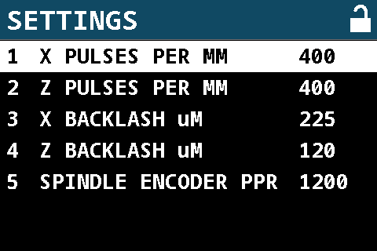

#### X pulses per MM

X axis stepper / servo pulses per MM. This should include any gear ratios in transmission.

#### Z pulses per MM

Z axis stepper / servo pulses per MM. This should include any gear ratios in tranmission, especially if you're using
the gearbox.

#### X backlash uM

X backlash in microns. You can measure this by using a dial gauge against the cross slide and driving the stepper in
one direction for a full rotation and reversing to measure the amount of distance the stepper has to drive the axis before the
dial gauge indicates movement.

#### Z backlash uM

Z backlash in microns. Measure as above.

#### Spindle encoder PPR

Pulses per one revolution of the spindle. Note, this is usually the actual pulses generated by the encoder times any
gear ratios in drive mechanism. You can drive the encoder at 1.5-2x the speed of the spindle but pay attention to the
maximum RPM rating for the encoder.

#### X retract jog speed mm/s

Speed at which X axis retraction is done, can be slowed or sped up depending on gear / pulley ratios.

#### Z retract jog speed mm/s

Speed at which Z axis retraction is done, can be slowed or sped up depending on gear / pulley ratios.

#### X closed loop

If DRO is connected, then uses a simple closed loop traversal for linear movements on X axis. This can be particularly useful for turning stock to a specific diameter but it will depend on the accuracy of your DRO.

#### Z closed loop

If DRO is connected, then uses a simple closed loop traversal for linear movements on Z axis.

### Manual Turning

**NOTE**

When soft limits are turned on, with conventional turning the tool is moved from right to left along the Z axis at the
set feed rate until the minimum position is reached.

Steps:

1. Move tool to Z/X origin as required
2. Zero out Z and X axis optionally for DRO.
3. Set feed
4. Set length and enable soft limit (optional)
5. Turn on spindle
6. Press Ready to start
7. If soft limit is enabled, when the tool reaches the soft limit the feed will stop.
8. Back off tool, jog to Z origin.
9. Feed in tool and press Ready again

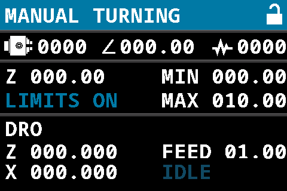

#### F/P

Set feed. The feed rate is independent of the spindle RPM at mm/s.

#### Reverse direction

Reverses feed direction. The usual direction is right to left towards spindle.

#### Z/X

1. Set Z axis, jogging
2. Pressing the button again switches to X axis setting, only used for zeroing the DRO reading (if available).

#### 0

Zero Z axis or X axis (DRO)

#### F1

Set the length to turn, Z soft limit target.

#### F2

Turns on / off soft limits. This will stop Z drive when the position reaches Z min.

#### Jog to Z origin

Jog Z axis to origin position

### Manual Threading

**NOTE**

When soft limits are turned on, with conventional turning the tool is moved from right to left along the Z axis at the
set pitch ratio until the minimum position is reached.

Steps:

1. Move tool to Z/X origin as required
2. Zero out Z and X axis
3. Set pitch
4. Set length
5. Turn on spindle
6. Press Ready to start
7. When the tool reaches the soft limit, it will stop.
8. Back off tool, press Jog to origin
9. Feed in tool and press Ready again

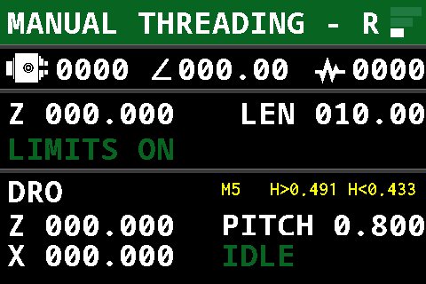
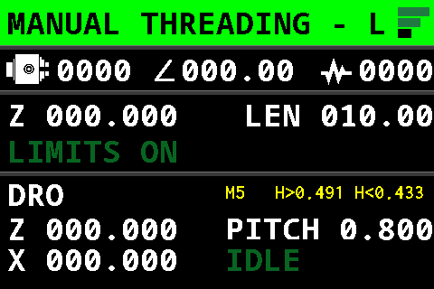

#### F/P

Choose pitch - the pitch determines the feed rate and this is tied to the rotation of the spindle.

You can pick a standard metric pitch with the displayed thread crest dimension. Pressing the key again will allow you to set
an arbitrary pitch value. This can be used to turn approximate imperial threads.

#### Reverse direction

While in pitch settings, pressing reverse feed direction allows you cut left hand threads or right hand threads.

#### Z/X

1. Set Z axis, jogging and setting min / max positions for virtual stop.
2. Pressing the button again switches to X axis setting, only used for zeroing the DRO reading.

#### 0

Zero Z axis or X axis (DRO)

#### F1

Set length

#### F2

Unused

#### Jog Z to Origin

Jog Z axis to 0 position

### Turning

Steps:

1. Move tool to Z/X origin as required
2. Zero out Z and X axis
3. Set roughing feed and feed for finish pass
4. Set the roughing depth of cut and depth of cut for finish pass
4. Set length and turning depth
5. Turn on spindle
6. Press Ready to start

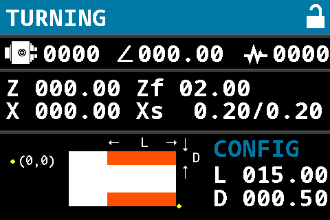

#### F/P

Set feed & depth of cut.

NOTE: The feed rate is independent of the spindle RPM at mm/s.

Press key to cycle through

1. roughing feed rate in mm/s
2. finishing pass feed rate in mm/s
3. roughing depth of cut in mm
4. finishing pass feed rate in mm/s

#### Z/X

1. Z axis jogging.
2. Press key again for X axis jogging

#### 0

Zero Z axis or X axis (DRO)

#### F1

1. Set length
2. Press key again to set depth

#### F2

Display DRO or diagram.

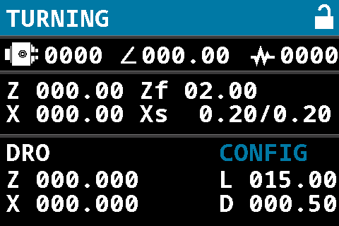


### Facing

Steps:

1. Move tool to Z/X origin as required
2. Zero out Z and X axis
3. Set feed
4. Set depth of cut on Z for each pass
4. Set length on Z axis to face and depth (radius of stock to face)
5. Turn on spindle
6. Press Ready to start

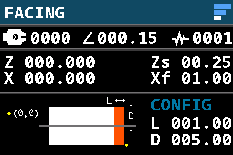

#### F/P

Set feed (Xf) & depth of cut (Zs).

#### Z/X

1. Z axis jogging.
2. Press key again for X axis jogging

#### 0

Zero Z axis or X axis (DRO)

#### F1

1. Set length
2. Press key again to set depth

#### F2

Display DRO or diagram.


### Parting

Steps:

1. Move tool to Z/X origin as required
2. Zero out Z and X axis
3. Set feed (Xf)
4. Set depth of cut (radius of stock to part off)
5. Set retraction rate (Rx) if needed. e.g. if set to 2mm, this retracts the tool 5mm for every 2mm of in-feed.
5. Turn on spindle
6. Press Ready to start

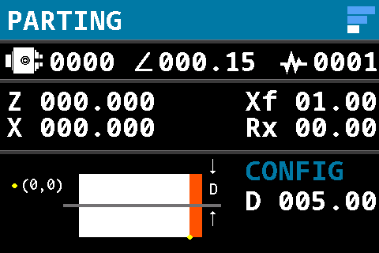

#### F/P

Set feed (Xf) & retraction (Rx).

#### Z/X

1. Z axis jogging.
2. Press key again for X axis jogging

#### 0

Zero Z axis or X axis (DRO)

#### F1

Set total depth to part off, this is half the stock diameter ideally.

#### F2

Display DRO or diagram.


### Boring Pocket

Steps:

1. Move tool to Z/X origin as required
2. Zero out Z and X axis
3. Set feed and depth of cut
4. Set depth and turning radius
5. Turn on spindle
6. Press Ready to start

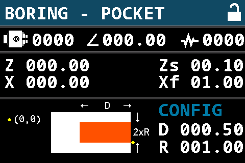

#### F/P

1. Set feed. The feed rate is independent of the spindle RPM at mm/s.
2. Press key again to set depth of cut for turning pass.

#### Z/X

1. Z axis jogging.
2. Press key again for X axis jogging

#### 0

Zero Z axis or X axis (DRO)

#### F1

1. Set depth
2. Press key again to set radius

The diameter of the bore is twice the radius.

#### F2

Display DRO or diagram.

### Boring Hole

Steps:

1. Move tool to Z/X origin as required
2. Zero out Z and X axis
3. Set feed and depth of cut
4. Set depth and width for stock removal
5. Turn on spindle
6. Press Ready to start

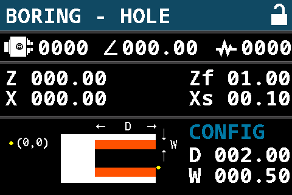

Use this if you have drilled a hole or performing boring operation with a through hole.

#### F/P

1. Set feed. The feed rate is independent of the spindle RPM at mm/s.
2. Press key again to set depth of cut for turning pass.

#### Z/X

1. Z axis jogging.
2. Press key again for X axis jogging

#### 0

Zero Z axis or X axis (DRO)

#### F1

1. Set depth
2. Press key again to set width of stock to remove.

#### F2

Display DRO or diagram.

### Knurling

Uses a form of bidirectional multi-start threading operation to cut knurls. Given the large pitch sizes required,
it's best to hand turn the spindle or use RPM < 30.

Steps:

1. Move tool to Z/X origin as required
2. Zero out Z and X axis
3. Set (L) length of the stock to knurl
4. Set (d) depth to cut
5. Set (D) diameter of stock
6. Set (A) lead angle, default to 30 deg.
7. Set (N) number of knurls.
8. Turn on spindle
9. Press Ready to start

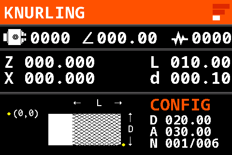

#### Z/X

1. Z axis jogging.
2. Press key again for X axis jogging

#### 0

Zero Z axis or X axis (DRO)

#### F1

Sets length, cut depth, diameter, lead angle and knurl count. Press F1 again to cycle through the settings.

#### F2

Display DRO or diagram.

### External Threading

Steps:

1. Move tool to Z/X origin as required
2. Zero out Z and X axis
3. Set pitch (and optionally thread height)
4. Set length and depth of cut
5. Turn on spindle
6. Press Ready to start

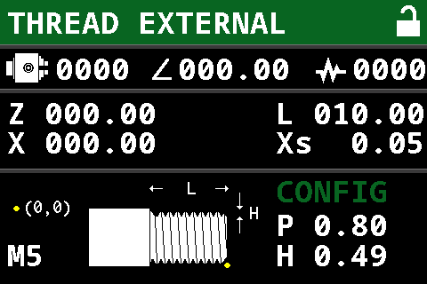
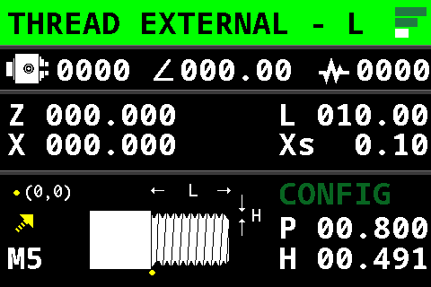

#### F/P

1. Select pitch, cycles through standard metric pitches.
2. Press key again to set an arbitrary pitch and thread height / depth.
3. Press "Reverse Direction (`</>`)" button to switch between RH and LH threads.

#### Z/X

1. Z axis jogging.
2. Press key again for X axis jogging

#### 0

Zero Z axis or X axis (DRO)

#### F1

IMPORTANT: The diagonal infeed hard codes the angle to 26.565° which is only valid for 60° thread profiles.

1. Set length of thread
2. Press key again to set depth of cut.
3. While in depth of cut selection press "Reverse Direction (`</>`)" button to switch between plunge and diagonal in-feed.

#### F2

Display DRO or diagram.

### Internal Threading

TODO: add support for LH threads and diagonal in-feed

Steps:

1. Move tool to Z/X origin as required
2. Zero out Z and X axis
3. Set pitch (and optionally thread depth)
4. Set length and depth of cut
5. Turn on spindle
6. Press Ready to start

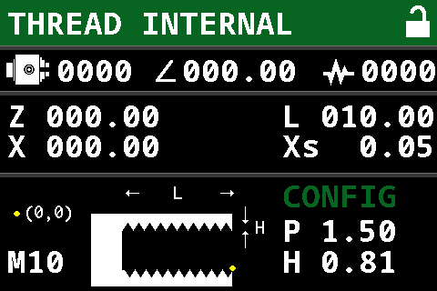

#### F/P

1. Select pitch, cycles through standard metric pitches.
2. Press key again to set an arbitrary pitch and thread height / depth.

#### Z/X

1. Z axis jogging.
2. Press key again for X axis jogging

#### 0

Zero Z axis or X axis (DRO)

#### F1

1. Set length of thread
2. Press key again to set depth of cut.

#### F2

Display DRO or diagram.

### External Taper - Right

Steps:

1. Move tool to Z/X origin as required
2. Zero out Z and X axis
3. Set feed and depth of cut
4. Set length and depth of taper. Press F2 - The angle should be displayed in addition to DRO values.
5. Turn on spindle
6. Press Ready to start

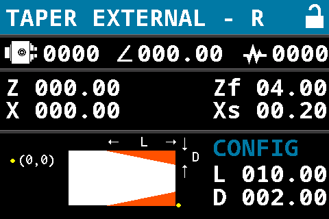

#### F/P

1. Select feed, mm/s.
2. Press key again to set depth of cut.

#### Z/X

1. Z axis jogging.
2. Press key again for X axis jogging

#### 0

Zero Z axis or X axis (DRO)

#### F1

1. Set length of taper
2. Press key again to set depth of taper.

#### F2

Display DRO or diagram. This also displays the taper angle.

### External Taper - Left

Steps:

1. Move tool to Z/X origin as required
2. Zero out Z and X axis
3. Set feed and depth of cut
4. Set length and depth of taper. Press F2 - The angle should be displayed in addition to DRO values.
5. Turn on spindle
6. Press Ready to start

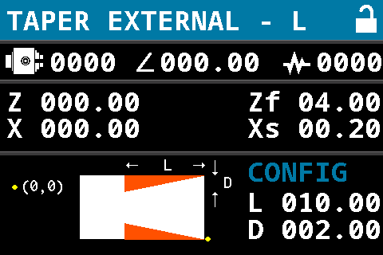

#### F/P

1. Select feed, mm/s.
2. Press key again to set depth of cut.

#### Z/X

1. Z axis jogging.
2. Press key again for X axis jogging

#### 0

Zero Z axis or X axis (DRO)

#### F1

1. Set length of taper
2. Press key again to set depth of taper.

#### F2

Display DRO or diagram. This also displays the taper angle.

### Internal Taper

Steps:

1. Move tool to Z/X origin as required
2. Zero out Z and X axis
3. Set feed and depth of cut
4. Set length and depth of taper. Press F2 - The angle should be displayed in addition to DRO values.
5. Turn on spindle
6. Press Ready to start

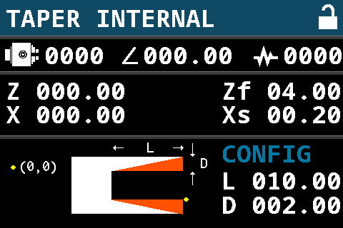

#### F/P

1. Select feed, mm/s.
2. Press key again to set depth of cut.

#### Z/X

1. Z axis jogging.
2. Press key again for X axis jogging

#### 0

Zero Z axis or X axis (DRO)

#### F1

1. Set length of taper
2. Press key again to set depth of taper.

#### F2

Display DRO or diagram. This also displays the taper angle.

### Convex External - Right

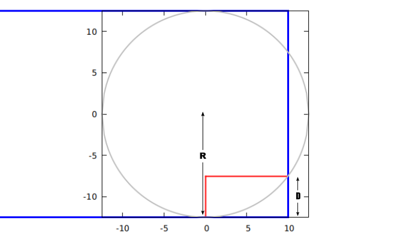

Glossary:

1. (z0, x0) and (z1, x1), intersection of arc with stock.
2. Radius: Radius of the arc.
3. Depth: depth of arc, x1 - x0
4. Length: length of arc, z1 - z0

Varying the radius, length and depth will allow a variety of convex curves to be turned.

Steps:

1. Move tool to Z/X origin as required
2. Zero out Z and X axis
3. Set feed and depth of cut
4. Set radius, length and depth of arc.
5. Turn on spindle
6. Press Ready to start


#### F/P

1. Select feed, mm/s.
2. Press key again to set depth of cut.

#### Z/X

1. Z axis jogging.
2. Press key again for X axis jogging

#### 0

Zero Z axis or X axis (DRO)

#### F1

1. Set radius of circle
2. Press key again to set depth.
3. Press key again to set length.

#### F2

Display DRO or diagram.

### Convex External - Left

Steps:

1. Move tool to Z/X origin as required
2. Zero out Z and X axis
3. Set feed and depth of cut
4. Set radius, length and depth of arc.
5. Turn on spindle
6. Press Ready to start

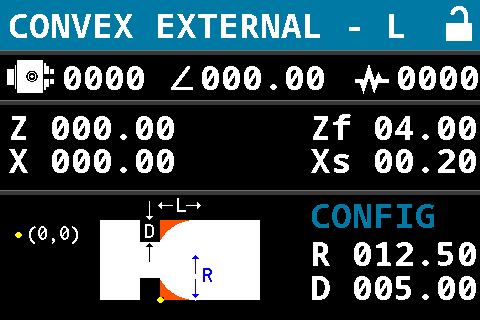

#### F/P

1. Select feed, mm/s.
2. Press key again to set depth of cut.

#### Z/X

1. Z axis jogging.
2. Press key again for X axis jogging

#### 0

Zero Z axis or X axis (DRO)

#### F1

1. Set radius of circle
2. Press key again to set depth.
3. Press key again to set length.

#### F2

Display DRO or diagram.

### Concave External - Right

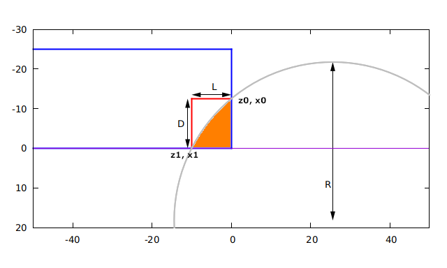

Glossary:

1. (z0, x0) and (z1, x1), intersection of arc with stock.
2. Radius: Radius of the arc.
3. Depth: depth of arc, x1 - x0
4. Length: length of arc, z1 - z0

Steps:

1. Move tool to Z/X origin as required
2. Zero out Z and X axis
3. Set feed and depth of cut
4. Set radius, length and depth of arc.
5. Turn on spindle
6. Press Ready to start

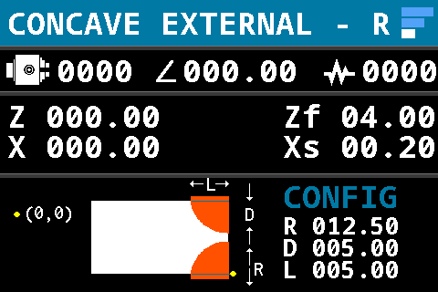

#### F/P

1. Select feed, mm/s.
2. Press key again to set depth of cut.

#### Z/X

1. Z axis jogging.
2. Press key again for X axis jogging

#### 0

Zero Z axis or X axis (DRO)

#### F1

1. Set radius of circle
2. Press key again to set depth.
3. Press key again to set length.

#### F2

Display DRO or diagram.

### Concave External - Left

TODO

### Rounded Groove

TODO

### Straight Groove

TODO
